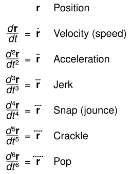

## 私自身が興味のある学問
数学、物理、化学、言語学、哲学、コンピュータサイエンス、生物学に興味がある。だがその中で、特に今の時代はコンピュータサイエンスが大きく変容するだろう。

## CSがサチる時代はもう来ている
LinkedIn, YouTubeなどでも、Is computer science dead? とか言われがちになった。AIの台頭だ。大学でコンピュータサイエンスを学ばなくても、「コンピュータでコンピュータサイエンスを学ぶ」ことができるようになったのも大きい。もうCSは飽和してしまった......。私たちにできるのは、物理世界や数学世界をいじることで、それによってしかテクノロジーの加速は進められないだろう（もっとも、AI自体が勝手に加速するのだけれど、加速を加速させることができるのは私たち人間であるということ。そしてその加速をまた....のように、テクノロジーのなかにフラクタルを見出すだろう。）。

画像

<small>[Time derivatives of position.svg](https://commons.wikimedia.org/wiki/File:Time_derivatives_of_position.svg) by Cmglee / [CC BY-SA 4.0](https://creativecommons.org/licenses/by-sa/4.0/)</small>

↑　このような時間微分的世界観の中で私たちができることは、「いや微分ってなんですか」「時間って何」と原理を追求することであると結論する。

